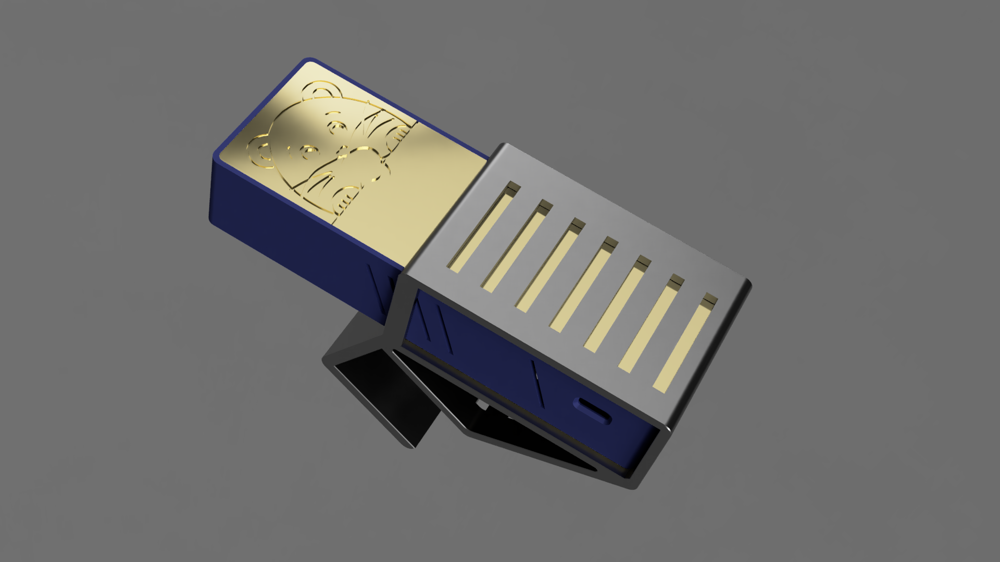

# Baby camera

## Bill of Materials
- [Raspberry Pi Zero 2 W](https://rpishop.cz/zero/4311-raspberry-pi-zero-2-w-5056561800004.html)
- [Raspberry Pi NoIR Camera V2](https://rpishop.cz/mipi-kamerove-moduly/331-raspberry-pi-noir-kamera-modul-v2.html)
- [Raspberry Pi Zero 38mm camera cable](https://rpishop.cz/mipi/695-548-raspberry-pi-zero-kamera-kabel-15cm.html#/153-delka-38_mm)
- [Adafruit Powerboost 1000C](https://learn.adafruit.com/adafruit-powerboost-1000c-load-share-usb-charge-boost)
- [Adafruit I2S MEMS Microphone](https://learn.adafruit.com/adafruit-i2s-mems-microphone-breakout)
- Li-Pol battery 3,7V / 3000mAh
- 4x [IR LED 5mm](https://www.gme.cz/infra-led-5mm-lte5208ac)
- [Rocker Switch](https://www.gme.cz/p-sm101-1r3)
- Transistor
- 10R Resistor

## Installation
sudo raspi-config ... enable legacy camera

    touch .hushlogin && sudo rm /etc/profile.d/sshpwd.sh && sudo rm /etc/profile.d/wifi-check.sh
    echo "awb_auto_is_greyworld=1" | sudo tee -a /boot/config.txt > /dev/null

#sudo nano /etc/avahi/avahi-daemon.conf ... use-ipv6=no

    sudo apt-get update && sudo apt-get install -y software-properties-common avahi-daemon libffi-dev libssl-dev python3-dev python3 python3-pip wiringpi vlc

### Docker
    curl -fsSL get.docker.com -o get-docker.sh && sudo sh get-docker.sh && sudo usermod -aG docker pi && sudo pip3 install docker-compose
    sudo reboot

### Service discovery
    docker run -d --network host --restart=always --name nsd docker.kapusnik.cz/nsd:python

### Sound setup
    sudo pip3 install --upgrade adafruit-python-shell
    wget https://raw.githubusercontent.com/adafruit/Raspberry-Pi-Installer-Scripts/master/i2smic.py
    sudo python3 i2smic.py

    https://github.com/mpromonet/v4l2rtspserver/issues/94#issuecomment-378788356
    #alsamixer (boost)

### RTSP server
    sudo apt-get install -y liblivemedia-dev liblog4cpp5-dev libasound2-dev cmake git
    git clone https://github.com/mpromonet/v4l2rtspserver.git
    cmake . -Wno-dev && make

### Startup script
    #sudo nano /etc/rc.local
    /home/pi/v4l2rtspserver/v4l2rtspserver -F 25 -W 800 -H 600 -P 8555 /dev/video0,lp

